# Flex 布局教程，前端必会的基础技能

### 前言

flex 是常用的 css3 布局方式，可以用少量的代码高效的实现各种页面布局，是一个基础的但是必须会的基本技能，在面试中经常会用到。

例如，最基本的让你实现元素的水平／垂直居中，或在这个基础上延伸出更多其他复杂一些的问题。

下面我们先简单的认识一下 flex，了解一下 flex 有哪些属性，再结合示例对每一个属性进行讲解，进一步了解 flex 的使用，掌握每一个属性的作用。属性比较多，配合使用可以实现各种各样的布局，为了篇幅不过于冗余，不会过多的举例。

如果您之前还没掌握 flex 布局，希望你在看这篇文章时，可以边看边动手实现每个例子，并尝试更多的排列组合实现不同的效果，加深印象。并在以后运用到实际项目中，这样才能真正掌握好这个技能。

如果您已经掌握 flex 布局，也希望能帮你温习温习，加深记忆。

有时候隔一段时间没用，可能会忘记某个属性的作用，回过头再看一下这篇文章，可以快速唤起记忆。

欢迎一起学习交流，如有错漏欢迎指出^_^。


### 一、flex 简单介绍

Flex 全称 Flexible box 布局模型，通常称为  flexbox 或 flex，也称为弹性盒子或弹性布局。一种比较高效率的 css3 布局方案。

既然是盒子，首先需要一个容器 container，然后是元素 item。容器包裹着元素，再通过配置不同的属性，实现各种各样的排列分布。

flex 有两根轴线，分别是主轴和交叉轴，主轴的方向由 `flex-diretion` 属性控制，交叉轴始终垂直于主轴。

容器为元素的分布提供的空间，轴线则控制元素的排列跟对齐的方向， flex 是一种一维的布局，一个容器只能是一行（左右）或者一列（上下），通过主轴控制子元素排列的方向（上下/左右），交叉轴配合实现不同的对齐方式。有时候一行放不下，可以实现多行的布局，但是对于 flex 来说，新的一行就是一个新的独立的 flex 容器。作为对比的是另外一个二维布局 CSS Grid 布局，可以同时处理行和列上的布局。


* **flex container（容器）**／**flex item（元素，也称为项目）**
* **main axis（主轴）**：元素排列布局的方向，默认是水平方向。
* **main start（主轴起始位置）**：元素排列布局的起始位置，容器的左边缘线位置。
* **main end（结束位置）**：元素排列布局的结束位置，容器的右边缘线位置。
* **main size**：元素沿主轴方向所占的尺寸。
* **cross axis（交叉轴）**：垂直与主轴，与元素的对齐相关，默认是垂直方向。
* **cross start（交叉轴起始位置）**：容器的顶部边缘线。
* **cross end（结束位置）**：容器的底部边缘线。
* **cross size**：元素沿交叉轴方向所占的尺寸。


### 二、flex 的两根轴线

当使用 flex 布局时，首先想到的是两根轴线 — 主轴（Main Axis）和交叉轴（Cross Axis）。主轴由 `flex-direction` 定义，交叉轴垂直于主轴。

理解主轴和交叉轴的概念对于对齐 flex 里面的元素是很重要的，flexbox 的特性是沿着主轴或者交叉轴对齐之中的元素，接下来要学习掌握的 flex 的所有属性都与这两根轴线有关，必须要理解它。

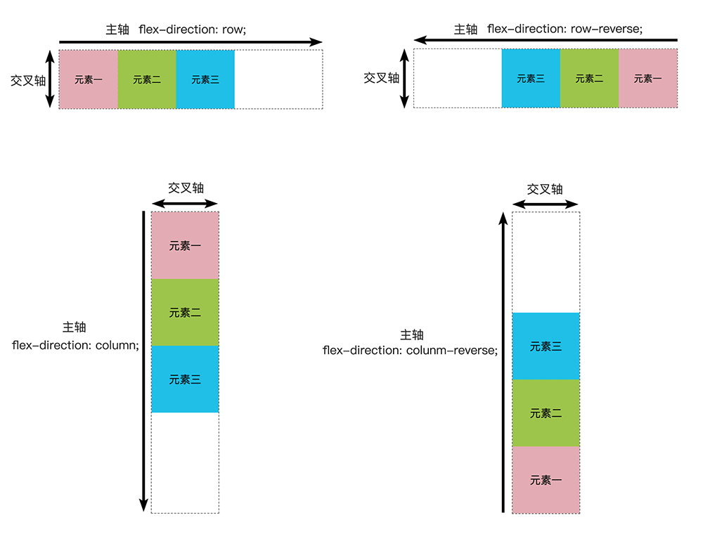

> 主轴方向，箭头的起始位置的容器边缘线就是对应轴的起始位置，同理重点位置的容器边缘线对应轴的终点位置。
>
> 交叉轴垂直于主轴，主轴是 `row／row-reverse` -水平方向的时候，交叉轴的起始位置是顶部边缘，结束位置是底部边缘线。主轴是 `column/column-reverse` - 垂直方向的时候，交叉轴的起始位置是容器的左边边缘线，结束位置是右边边缘线。


### 三、flex 容器（container）

flex 必须有一个容器 container，跟多个子元素 item。

当把一个元素的 display 属性设置为 flex 或者 inline-flex 后，它就成了一个容器。

元素变成容器后，就会有一些默认的行为，如果现在看不懂，先大概有个印象：

1. 子元素的 `block`、 `float`、`clear` 和 `vertical-align` 属性都失效。因为元素的排列对齐方式已经变成由 flex 属性控制。flex 属性有默认值，后面会详细说明每个属性的作用与默认值。
2. 元素从左到右（主轴方向）排列为一行 (`flex-direction` 属性的初始值是 `row`)。
3. 元素在主纬度（主轴）方向，不会拉伸，但如果元素加起来超出容器范围则默认会自动缩小，不会另起一行。
4. 元素在交叉轴方向如果没有设置高度，会被拉伸填充满容器，如果容器没有设置高度则以最高的元素的高度为容器的高度。

下面是一个简单的例子：

```html
<div class="container">
  <div class="item">元素一</div>
  <div class="item">元素二</div>
  <div class="item">元素三</div>
</div>
<style>
  .container {
    display: flex;
    width: 300px; // 把容器宽度设置为 300px;没有设置高度。
  }
  .item {
    width: 150px; // 每个元素宽度为 150px，加起来大于 300px
    line-height: 100px; // 设置元素默认撑开的高度为 100px
  }
  .container :nth-child(1) {
    background-color: #E3ABB3;
    height: 100px; // 第一个元素给定固定高度 100px；
  }
  .container :nth-child(2) {
    background-color: #9DC54B;
  }
  .container :nth-child(3) {
    background-color: #1FBEE7;
    height: 300px;
  }
</style>
```

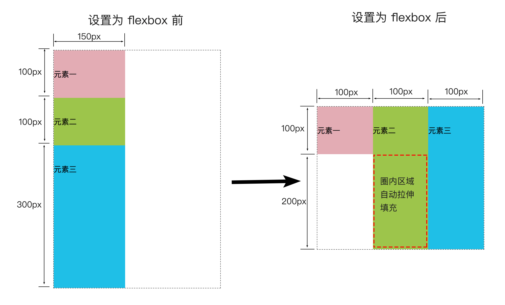

上面例子展示了 设置为 flex 后的容器的一些变化。

1. 设置前，容器内元素是块级元素，设置后，行为变成行内元素。
2. 设置前，元素宽为 150px，设置后自动缩小成100px，因为容器宽度设置了 300px。
3. 设置前，容器高度是撑开到 500px，设置后，变成 300px，与元素中最高的元素三高度一致。
4. 设置前，元素一为 100px，设置后，高度不变，因为元素本身设置了高度，
5. 设置前，元素二为 100px，设置后，高度被拉伸到 300px，与容器等高，因为元素二本身没有设置高度。


基于上面这些默认行为，有的同学可能会有疑问。

如果不想从左到右，想从右到左怎么办？（常见的需求）

如果不想元素自动缩小，想换行怎么办？（常见的需求）

如果不想顶部对齐，想垂直居中怎么办？

…


带着这些问题，来看看 flex 是怎么实现的。


### 四、flex 的属性

与 Flex 有关的属性，主要包括以下几个：

###### 用于容器 container 的属性：

1. <font color="red">`flex-direction`</font> - 用于指定主轴的方向，有4个常用选项  `row` 、`row-reverse`、 `colunm` 、`colunm-reverse` 。`row` 是行（与 `inline` 行为一致，从左向右 → ），`colunm` 是列（与 `block` 行为一致，从上到下 `↓` ）。带上 `reverse` 的是指反向，即原来 `row` 是左右 `→` ，`row-reverse` 就是右左 `←`，`column` 是上下 `↓`，则 `column` 就是下上 `↑` 。
2. <font color="red">`flex-wrap`</font> - 用于指定项目太多超过一行的时候是否换行。默认 `flex-wrap: nowrap;` 不换行。
3. <font color="red">`flex-flow`</font> - 是 `flex-direction` 和 `flex-wrap` 的合并简写。`flex-flow: <flex-direction> <flex-wrap>;`
4. <font color="red">`justify-content`</font> - 用于控制元素在主轴上的对齐方式。默认是 `justfy-content: flex-start;` ，主轴起始线对齐。
5. <font color="red">`align-items`</font> - 用于控制元素在交叉轴上的对齐方式。默认是 `align-items：stretch;` ，如果元素没有设置高度，则拉伸填充到容器同样高度，如果设置了高度则顶部对齐。
6. <font color="red">`align-content`</font> - 用于控制多根轴线（多行）在交叉轴上的对齐方式。

###### 用于子元素 item 的属性：

1. <font color="red">`flex-grow`</font> - 用于控制元素在主轴方向上拉伸放大占剩余空间（如果有的话）的比例。默认是 `flex-grow: 0` ，不拉伸。
2. <font color="red">`flex-shrink`</font> - 用于控制元素在主轴方向上缩小的程度。默认是 `flex-shrink: 1` ，同等比例收缩。数值越大，收缩越多。
3. <font color="red">`flex-basis`</font> - 用于初始化元素占据主轴空间的尺寸，默认是 `flex-basis: auto;` ，自动检测尺寸，如果元素有设置，则取元素设置的值，否则根据元素内容计算出尺寸。
4. <font color="red">`flex`</font> - 是上面三个合并的简写 `flex: <flex-grow> <flex-shrink> <flex-basis>;` 。
5. <font color="red">`align-self`</font> - 控制元素本身在交叉轴上的对齐方式。优先级高于 `align-items`。默认是 `align-self: auto;` ，意思是使用 `align-items` 设置的值。比 `align-items` 多一个 `auto` 选项，其他选项与 `align-items` 一致。
6. <font color="red">`order`</font> - 用于控制元素在主轴上的排列顺序。默认是 0 ，全部元素按主轴方向依次排列。设置后，按数值大小，从小到大排列。


> 接下来是每个属性的使用说明

以下面代码为例子：

```html
<div class="container">
  <div class="item">元素一</div>
  <div class="item">元素二</div>
  <div class="item">元素三</div>
  <div class="item">...</div>
</div>
<style>
  .container {
    display: flex;
    border: 1px dashed #666666;
    text-align: center;
    width: 400px; // 把容器宽度设置为 400px;没有设置高度。
  }
  .item {
    width: 100px; // 每个元素宽度为 150px，加起来大于 300px
    line-height: 100px; // 设置元素默认撑开的高度为 100px
  }
  .container :nth-child(1) {
    background-color: #E3ABB3;
  }
  .container :nth-child(2) {
    background-color: #9DC54B;
  }
  .container :nth-child(3) {
    background-color: #1FBEE7;
  }
</style>
```


#### flex 容器的属性：flex-direction

`flex-direction` 在前面介绍轴线的时候就提到这个，direction 是方向，指向的意思，所以这个属性主要用于改变轴线的方向。也就是元素的排列方向。

`flex-direction` 有 4 个常用选项值。

```css
.container {
  flex-direction: row | row-reverse | column | column-reverse;
}
```

默认值：`flex-direction: row;`。

`row` 与 `row-reverse` 是水平方向，`cloumn` 与 `cloumn-reverse` 是垂直方向。 reverse 是颠倒、相反的意思，所以带 reverse 的总与不带的方向相反。


> 注：下面例子中元素未超出容器，白色格子假设表示容器“剩余的空间”，这里讲剩余空间是为了方便理解，实际上这个空间被叫做 **positive free space** ，如果元素超出的容器空间，溢出的部分叫做 **negative free space**。

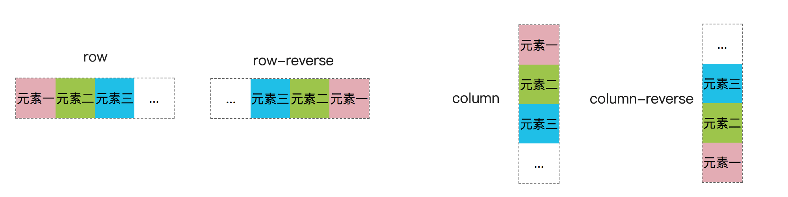

* `row` ：默认值，主轴方向为水平方向，从**左向右**排列，起始位置是容器的**左**边线；
* `row-reverse`：主轴方向是水平方向，从**右向左**排列，起始位置是容器的**右**边线；
* `column`：垂直方向，从**上到下**排列，其实位置是容器的**上**边线；
* `column-reverse`：垂直方向，从**下到上**排列，起始位置是容器是**下**边线；


#### flex 容器的属性：flex-wrap

`flex-wrap` 有 3 个常用选项值，用于指定项目太多超过一行的时候是否换行。

```
.container {
  flex-wrap: nowrap | wrap | wrap-reverse;
}
```

默认值： `flex-wrap: nowrap;` 不换行。

设置值为 `wrap` 时，如果一行放不下所有元素的时候，就会自动在换行显示，新的一行的一个新的容器。如果 `flex-direction` 属性为 `row` ，则创建新行、如果为 `column`则创建新列。

设置值为 `wrap-reverse`，也会换行，加上 reverse 后，换行的方向与原来相反。

> 接下来在上面的例子多加几个元素，来测一下 `flex-wrap` 的效果，例子以 `flex-deriction: row;` 水平方向试验，可自行测试其他方向下的行为，加深理解。

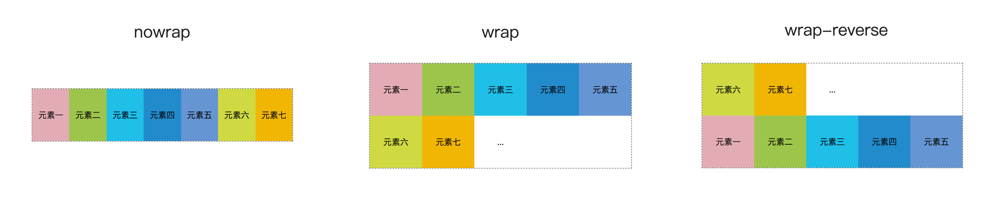

* `nowrap` ：默认值，元素没有换行，元素总宽度超过容器，自动缩小宽度。

* `wrap`：元素换行，新的一行在第一行元素的下方。

* `wrap-reverse`：元素换行，新的一行在第一行元素的上方。

> 这里可以试试把容器的高度设置为高于元素的高度，看看 `wrap` 和 `wrap-server` 在交叉轴方向上的怎么对齐的～
>
> 可以试试把 `flex-direction` 设置为 `column` 看看有什么不同～


#### flex 容器的属性： flex-flow

是 `flex-direction` 和 `flex-wrap` 的合并简写。

```css
.container {
  flex-flow: <flex-direction> <flex-wrap>;
}
```

默认是 `flex-flow: row nowrap;`

例如

```css
flex-flow: column wrap;
// 相当于
flex-direction: column;
flex-wrap: wrap;
```


#### flex 容器的属性：justify-content

justify 翻译过来是“使每行排齐、使齐行”，content 翻译过来是“内容”。合在一起大概意思就是使行的内容对齐的意思。所以，`justify-content`  是用于控制元素在主轴上的对齐方式。

有 6 个常用选项。

```
.container {
  justify-content: flex-start | flex-end | center | space-between | space-around | space-evenly;
}
```

默认值： `justify-content: flex-start;`

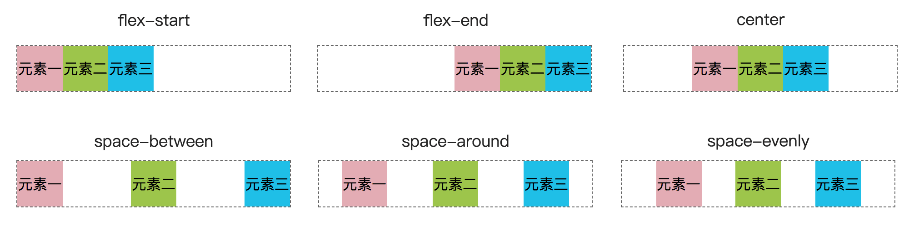

* `flex-start`：默认值，元素在主轴方向上，以主轴起始位置对齐。图例中主轴方向是从左到右，起始位置是容器的左边线，可以看到元素是左边对齐的。
* `flex-end`：元素在主轴方向上，以主轴结束的位置对齐。图例中结束位置是容器的右边线，所以是右边对齐。
* `center`：元素在主轴方向上居中。
* `space-between`：元素在主轴方向上，两端对齐，然后元素中间间隔是相等的。
* `space-around`：在主轴方向上，剩余的空间被平均的分配到每个元素的两侧。
* `space-evenly`：在主轴上，剩余空间平均分配，与 `space-between` 不同的是，between 是在元素之间，而 evenly 是在轴的最左边和最右边也同样会有空间分配。


><i>以下是我个人的理解，为了加深对这些参数的印象，你可以参考，也可以按你自己的方式理解记忆。</i>
>
>space 是“空间”的意思，between 是“在...之间”的意思，所以，可以看到 `space-between` 剩余的空间平均的分配在每个元素之间。
>
>around 是“四周、围绕”的意思。每个元素左右两边都会分配到相等的空间，并且元素与元素之间的空间独立不合并。图例中，元素一左边只有围绕它本身的空间，而右边有元素二元素三的空间，所以右边空间是左边的两倍。以此类推，在中间的元素的间隔都是“两倍”，直到最后一个元素的右边空间又是“一倍”。
>
>evenly 是“平均、均匀”的意思，所以，剩余的空间是均匀分配的。
>
>假设元素是 n 个，`space-between` 两端没有，只有元素之间间隔有，空间平均分配 n-1 份，在元素之间。`space-evenly` 两端也有，空间平均分配 n+1 份。`space-around` 是两侧都有，空间平均分配 2n 份。


#### flex 容器的属性：align-items

`align-items` 是控制元素在交叉轴上的对齐方式。

有 5 个常用选项。

```css
.container {
  align-items: stretch | flex-start | flex-end | center | baseline;
}
```

默认值：`align-items: stretch;`

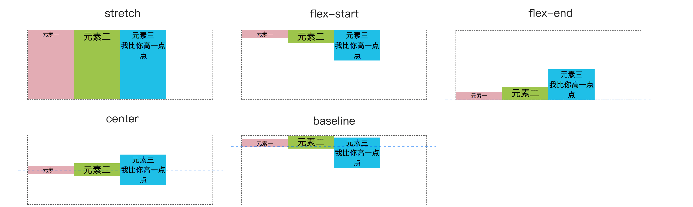

* `stretch`：默认值，如果元素没有设置固定高度，则会被拉伸填充满交叉轴方向剩余的空间。
* `flex-start`：元素在沿交叉轴起始线位置对齐。
* `flex-end`：元素沿交叉轴终点线位置对齐。
* `center`：元素在交叉轴方向居中对齐。
* `baseline`：元素在交叉轴方向沿元素中第一行文字的基线对齐。

> 这个也比较好理解，stretch 是“拉伸，拉长”的意思，所以元素会被拉伸。这里如果元素设置了固定高度，会沿交叉轴的起始位置对齐。
>
> start、end、center 分别的“起始”、“终点”、“中间”的意思，所以元素分别是起始位置、终端位置、居中对齐。
>
> baseline 是“基线、底线”的意思，这里是沿文字的基线对齐的意思。

#### flex 容器的属性：align-content

`align-content` 控制多行元素（多根主轴线）对齐方式。类似 ` justify-content` ，只不过，`align-content` 是控制行与行之间的空间分配，`justify-content` 是控制元素与元素之间的空间分配。

有 7 个常用的选项。

```css
.container {
  align-content: stretch | flex-start | flex-end | center | space-between | space-around | space-evenly;
}
```

默认值：`align-content: stretch;`

```html
<div class="container">
  <div class="item">元素一</div>
  <div class="item">元素二</div>
  <div class="item">元素三</div>
  <div class="item">元素四</div>
  <div class="item">元素五</div>
  <div class="item">元素六</div>
  <div class="item">元素七</div>
  <div class="item">元素八</div>
  <div class="item">元素九</div>
</div>
<style>
  .container {
    border: 1px dashed #666666;
    margin: 100px auto;
    display: flex;
    width: 150px;
    height: 250px;
    text-align: center;
    flex-direction: row;
    flex-wrap: wrap;
    /* flex-flow: column wrap; */
    /* justify-content: flex-start; */
    /* align-items: stretch; */
    align-content: stretch;
  }
  .item {
  	width: 50px; // 元素宽度为 50px
  }
  .container :nth-child(1) { background-color: #E3ABB3; height: 50px; }
  .container :nth-child(2) { background-color: #9DC54B; }
  .container :nth-child(3) { background-color: #1FBEE7; }
  .container :nth-child(4) { background-color: #218BCC; height: 50px; }
  .container :nth-child(5) { background-color: #6695D3; }
  .container :nth-child(6) { background-color: #CFD841; }
  .container :nth-child(7) { background-color: #F1B605; }
  .container :nth-child(8) { background-color: #E3ABB3; }
  .container :nth-child(9) { background-color: #9DC54B; height: 50px; }
</style>
```

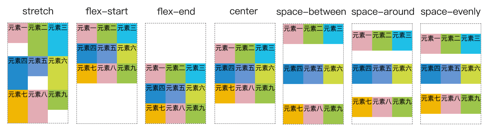

> 上面图例中元素一、五、九设置了固定的高度。其他元素高度自动识别。因为 `align-items` 的默认值的效果，其他元素会被拉伸填充到与行的高度同高。

* `stretch`：默认值，交叉轴方向剩余的空间平均分配到每一行，并且行的高度会拉伸，填满整行的空间。图例中，因为 `align-items` 默认值的效果，第一行高度原本是以最高的元素一的高度为行的高度。然后又因为 `align-content` 的效果，拉伸了行的高度。而其中，元素一设置了固定高度，所以没有被拉伸，元素二、三没有设置高度，所以被拉伸填充到与行同样的高度。
* `flex-start`：所有行在交叉轴方向上，以交叉轴的起始位置对齐。
* `flex-end`：所有行在交叉轴方向上，以交叉轴的终点位置对齐。
* `center`：所有行在交叉轴上居中对齐。
* `space-between`：行在交叉轴方向上，两端对齐，然后行中间的间隔相等。
* `space-around`：在交叉轴方向上，剩余的空间被平均的分配到每一行的两侧。
* `space-evenly`：在交叉轴方向上，剩余空间平均分配，与 `space-between` 不同的是，between 是在行之间，而 evenly 是在轴的最左边和最右边也同样会有空间分配。


#### flex 元素的属性：flow-grow

`flex-grow` 用于控制元素在主轴方向上拉伸放大占剩余空间（如果有的话）的比例。

grow 的意思是“扩大，使生长”，所以就是让元素放大的意思。

```css
.item {
  flex-grow: <number>;
}
```

默认值：`0`，不放大。

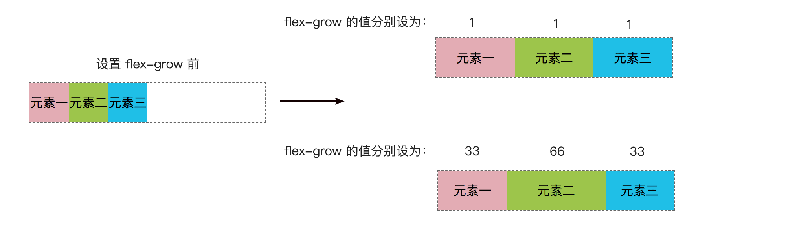

> 例子中，容器宽设为 300px，元素宽设为 50px。元素总宽 150px，剩余空间宽 150px
>
> flex-grow 都设置为 1 的时候，元素拉伸成 100px，剩余空间被按 1:1:1 分配，每个元素各占了 1/3。
>
> flex-grow 分别设为 33、66、66 的时候，元素分别被拉伸成 87.5px、125px、87.5px，剩余空间被按 1:2:1 分配，元素分别占了剩余空间的 1/4、1/2、1/4。
>
> 可以看到，放大的比例跟数值的大小无关，跟数值的比例有关。


#### flex 元素的属性：flow-shrink

`flex-shrink`  用于控制元素在主轴方向上缩小的程度。数值越大，收缩越多。但它与 `flex-grow` 不一样，不是按比例收缩的，具体的收缩算法原理可以参考 [控制Flex子元素在主轴上的比例](https://developer.mozilla.org/zh-CN/docs/Web/CSS/CSS_Flexible_Box_Layout/Controlling_Ratios_of_Flex_Items_Along_the_Main_Ax)。

shrink 是“收缩、缩小”的意思，所以就是让元素缩小的意思。

```css
.item {
  flex-shrink: <number>;
}
```

默认是 `flex-shrink: 1` ，同等比例收缩。

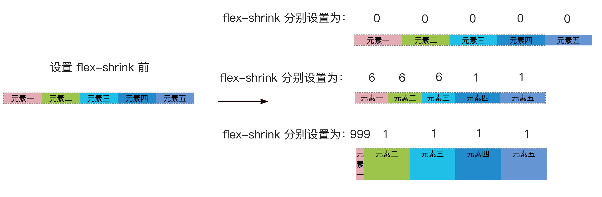

>例子中，容器宽为 400px，元素宽为100px。因为元素超过了容器空间，所以自动被缩小了。默认 flex-shrink 是 1，所有元素同等比例缩小成 80px。
>
>右上，设置 flex-shrink，全部设置为 0，元素保存原来设置的宽度 100px，不缩小，所以溢出容器空间。
>
>右中，设置 flex-shrink 分别为 6、6、6、默认、默认，元素宽变成 70px、70px、70px、95px、95px，超出的 100px 分成 20 份，按比例缩小。
>
>右上，设置 flex-shrink 分别为 999、默认、默认、默认、默认，元素宽变成 16px、96px、96px、96px、96px，可以看到这里就不按比例缩小的了。


#### flex 元素的属性：flex-basis

`flex-basis` 用于初始化每个元素占据主轴空间的尺寸（main size）。

```css
.item {
  flex-basis: <length> | auto;
}
```

默认值：`flex-basis: auto` , 自动检测尺寸，如果元素有设置尺寸，则取元素设置的值，否则根据元素内容计算出尺寸。

> 可以像设置 `width`，`height` 一样设置 `flex-basis`


#### flex 元素的属性：flex

`flex` 是上面三个合并的简写。

```css
.item {
  flex: <flex-grow> [<flex-shrink>] [<flex-basis>];
}
```

默认值：`flex: 0 1 auto;` 后两个参数为可选参数。

这个属性预定义了以下几种简写形式：

- `flex: initial` ：等同于 `flex: 0 1 auto`。默认值。这里 `flex-grow` 为 `0`， 所以元素默认不会拉伸，不会超出本身的 `flex-basis` 尺寸。`flex-shrink` 为 `1` ，所以元素可以缩小，防止它们溢出。`flex-basis` 为 `auto`，可以是手动设置的尺寸也可以自动根据内容计算出尺寸。
- `flex: auto`：等同于 `flex: 1 1 auto`。可以拉伸，可以缩小，自动计算元素尺寸，一般情况下会自动拉伸填充满整个容器。
- `flex: none`： 等同于  `flex: 0 0 auto`。不能拉伸，不能缩小，直接使用获取到元素的 `flex-basis` 尺寸。
- `flex: <positive-number>`：等同于 `flex: <positive-number> 1 0` 。positive-number 为正数，例如 `flex: 1` 等同于 `flex: 1 1 0`。


 #### flex 元素的属性：align-self

`align-self` 控制元素本身在交叉轴上的对齐方式。优先级高于 `align-items`。`align-items` 是容器统一控制容器里的每个元素的对齐方式，`align-self` 则是元素控制元素本身的对齐方式。

```
.item {
  align-self: auto | flex-start | flex-end | center | baseline | stretch;
}
```

默认值：`align-self: auto;` ，继承容器设置的 `align-items` 的值。也就是默认是由容器设置 `align-items` 统一控制元素在交叉轴上的对齐方式。

除了比 `align-items` 多一个 `auto` 选项外，其他选项与 `align-items` 一致。

```css
.container {
  dispaly: flex;
  align-items: flex-start; // 容器控制所有子元素顶部对齐排列
}
.item.four {
	align-self: flex-end; // 第四个元素控制底部对齐
}
```


#### flex 元素的属性：order

`order` 用于控制元素在主轴上的排列顺序。

```
.item {
 order: <number>;
}
```

默认值： `order: 0;` ，参数值正负数都可以，全部元素按主轴方向依次排列。设置后，按数值大小，从小到大排列。

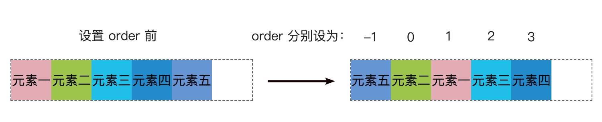


### 五、小技巧

###### 1. 解决 flex 布局使用 `space-between` 两端对齐，最后一行不对齐问题

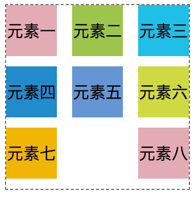

这是一种常用的布局方式，但是最后一行大部分时候，我们是希望他从左到右排列，而不是两端对齐

解决方案：使用 after 伪元素，把宽设置成与 item 一样

```css
.conatainer::after {
  content: ""; 
  width: 50px;
  /* height: 50px; */ // 如果给伪元素设置高和背景色，可以看到它的作用。
  /* background-color: #eeeeee; */
}
```


> 原理是，使用 after 伪元素模拟了最后一个元素，假装多了一个元素，占着最后一个位置。如果给伪元素设置高和背景色，可以看到它的作用。
>
> 但这个方法有个明显的缺点，只适合每行三个元素。超过三个元素就不行了。

###### 2. 解决 flex 布局的 `space-evenly` 兼容性问题

上面提到的 `justify-content: space-evenly;` 对齐方式，这个方式有个明显的缺点，就是兼容性较差。

当使用的环境中需要兼容较多浏览器的时候，可以考虑以下方案。

```css
.container {
	display: flex;
	justify-content: space-between;
}
.container::after,
.container::before {
  content: '';
  display: block;
}
```

>使用 after 伪元素，在容器两端模拟两个长度为 0 的元素，就能实现 evenly 同样的效果。
>
>缺点是只适合一行的布局。


### 六、示例

#### 圣杯布局

```html
<header>header</header>
  <div id='main'>
  	<article>article</article>
  	<nav>nav</nav>
  	<aside>aside</aside>
  </div>
<footer>footer</footer>
<style>
  body { font: 24px Helvetica; }
  #main {
    min-height: 500px;
    margin: 0px;
    padding: 0px;
    display: flex;
    flex-flow: row;
  }
  #main > article {
    margin: 4px;
    padding: 5px;
    border: 1px solid #cccc33;
    border-radius: 7pt;
    background: #dddd88;
    flex: 3 1 60%;
    order: 2;
  }
  #main > nav {
    margin: 4px;
    padding: 5px;
    border: 1px solid #8888bb;
    border-radius: 7pt;
    background: #ccccff;
    flex: 1 6 20%;
    order: 1;
  }
  #main > aside {
    margin: 4px;
    padding: 5px;
    border: 1px solid #8888bb;
    border-radius: 7pt;
    background: #ccccff;
    flex: 1 6 20%;
    order: 3;
  }
  header, footer {
    display: block;
    margin: 4px;
    padding: 5px;
    min-height: 100px;
    border: 1px solid #eebb55;
    border-radius: 7pt;
    background: #ffeebb;
  }
  /* 窄到已不足以支持三栏 */
  @media all and (max-width: 640px) {
    #main, #page {
      flex-direction: column;
    }
    #main > article, #main > nav, #main > aside {
      /* 恢复到文档内的自然顺序 */
      order: 0;
    }
    #main > nav, #main > aside, header, footer {
      min-height: 50px;
      max-height: 50px;
    }
  }
</style>
```

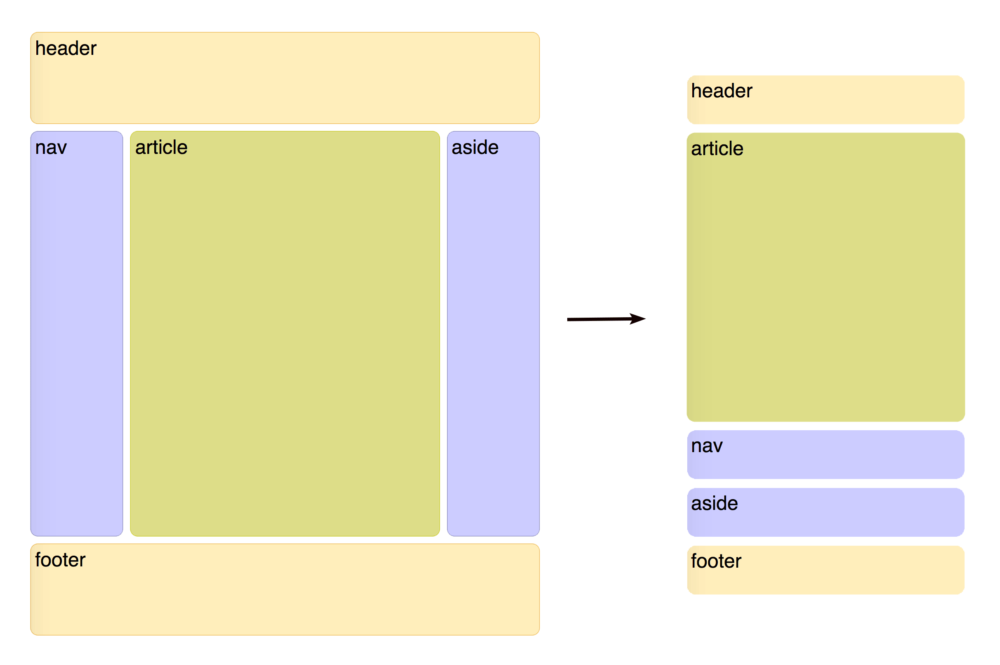


参考文档：MDN flex 布局文档


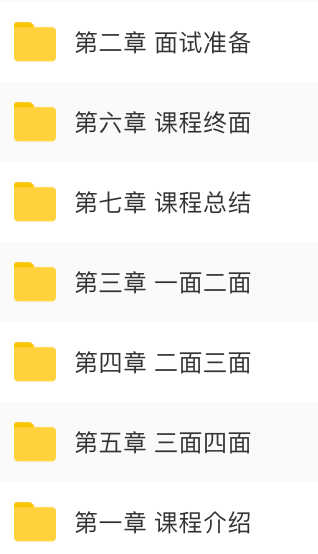

扫下方二维码或微信搜索，关注公众号「天才前端计划」，回复 “前端面试5” 获取资源链接。

视频来自互联网，仅供个人学习。

[](https://github.com/silinchen/mvvm/blob/master/img/qrcode_for_天才前端计划.jpg)

谢谢您的支持^_^


