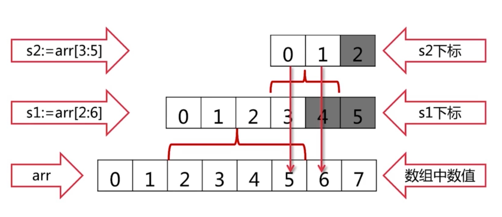
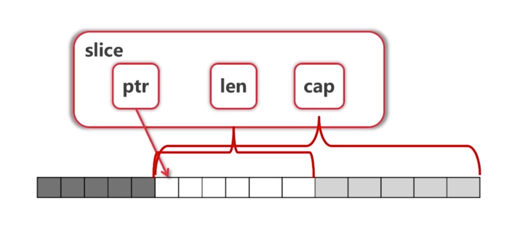

# Go 语言基础快速入门掌握基本语法


###  1. 经典hello word

先了解一下一个最简单的 go 文件包含哪些内容

```go
// 包声明，每个 .go 文件必须声明
package main
// 引入依赖库
import "fmt"
// main 入口函数
func main() {
  // 使用 fmt 库的 Println 方法，打印 hello world
  fmt.Println("Hello world！")
}
```

运行：使用命令行运行或使用 ide 运行

```shell
$ go run hello.go
```

编译：Go是一门编译型语言，Go语言的工具链将源代码及其依赖转换成计算机的机器指令，生成可执行文件。

```shell
$ go build hello.go			// 生成可执行文件 hello
$ ./hello 							// 运行编译后的程序
Hello world！						// 输出
```


### 2. 内建类型

#### 2.1 基础变量类型

| 类型名称                | 类型                                                   | 初始值（zero value） |
| ----------------------- | ------------------------------------------------------ | -------------------- |
| 整型                    | (u)int、(u)int8、(u)int16、(u)int32、(u)int64、uintptr | 0                    |
| 浮点数                  | float32、float64                                       | 0                    |
| 复数                    | complex64、complex128                                  | 0                    |
| 布尔值                  | bool                                                   | false                |
| 字符串                  | string                                                 | ""                   |
| 字节（alias for uint8） | byte                                                   | 0                    |
| rune（alias for int32） | rune                                                   | 0                    |

* 带 u 的是无符号整数，例如 uint8 范围 0~255。不带 u 的是有符号整数，例如 int8 -128~127
* uintptr 中 ptr 是指针的意思
*  int8、int16、int32、int64 是指定长度的，int、unitptr 是不指定长度的，长度随操作系统（32/64）

- byte，代表字节，长度 8位

* rune 是go 语言的 char 类型（字符型变量），rune 的长度是 32 位的，unicode 两个字节（16位），utf-8 很多字符都是 3 字节，所以 go 采用 int32

* byte、rune 这两种类型可以跟整数混用，相当于整数的 别名。
* float32、float64 指定长度的浮点数

* complex64、complex128 指定长度的 复数，有实部跟虚部，complex 64 的实部和虚部分别是 32位，complex128 的实部跟虚部分别是 64 位


complex 示例：

$i = \sqrt-1$

复数：$z=a+bi$，a 是实部，b是虚部，例如：$3+4i$

$|3+4i| = \sqrt{3^2 + 4^2} = 5$ 

$i^2 = -1$, $i^3 = -i$, $i^4 = i$

欧拉公式：$e^{ix} = cosx + isinx$


#### 2.2 复合类型

| 类型名称         | 类型    | 初始值（zero value） |
| ---------------- | ------- | -------------------- |
| 数组             | [n]T    | nil                  |
| slice            | []T     | nil                  |
| Map              | map[K]V | nil                  |
| Struct（结构体） |         | nil                  |


#### 2.3 强制类型转换

类型转换是强制的，赋值给一个整形，或者传参数给函数，如果类型不匹配，都需要显式转成对应的类型。

```go
var a, b int = 3, 4
// c = math.Sqrt(a*a + b*b) // 报错，类型不匹配，必须显式转换
c = int(math.Sqrt(float64(a*a + b*b))
```

不是所有的数据类型都可以转换为别的数据类型。必须确保两种数据类型之间的兼容性。


float 类型是不准确的，有可能最后计算出来的结果不是5，是4.999999..然后转成整形变成4。

怎么解决？


### 3. 变量

#### 3.1 变量声明

变量需要显式声明，变量声明使用 `var` 关键字或使用简短声明方式 `:=` 。

```go
// 声明语句如下
var 变量名字 类型 = 表达式
变量名字 类型 := 表达式
```

> 其中 var 声明语句的 “类型” 跟 “= 表达式” 是可以省略的其中之一的，如果类型省略，编译器会根据表达式，自动推断，如果表达式省略，编译器会给变量赋初始值（zero value）
>
> 使用 `:=` 声明语句，则必须要 “表达式”。只可以省略 “类型”


```go
// 声明一个变量
var foo string
var bar = "bar"

// 声明一组变量
var a, b string
var c, d int = 0, 1
var i, j, k = 1, 'str', false
var (
  x = 1
  y = false
  z = "str"
)

// 声明的类型与赋值的类型不一致会报错
// var str string = 5 // 报错

func main () {
  var i = 0
  
  // 简短声明方式声明变量，只能在函数内使用
  foo := "foo"
  // i := 1 // 或 var i = 1 都会报错。 i 已经声明过，不能重复声明
  // 如果 i 是在一组变量里，则可以。i 只被重新赋值，内存地址不变。
  i, j, k = 1, 'str', false
}
```


总结：

* 声明变量的方式有两种，使用 `var` 或 `:=` ；
* 包作用域下不能使用 `:=` 声明变量，只能使用 `var` 声明；
* 声明变量时，如果不指定变量类型，编译器会根据赋值的结果自动推断变量类型；
* 使用 var 声明语句声明变量时，可以只声明变量的类型，编译器会给变量赋初始值（zero value）
* 使用 `:=` 声明语句声明变量时，不必声明变量类型，但必须给变量赋值，编译器会自动推断变量类型。
* 重复声明变量会报错。但如果使用 `:=` 声明多个变量，并且有新声明的变量，则不会报错，原来的已存在变量会被重新赋值（类型必须与原来一样）。
* 可以同时定义多个相同类型的变量，可以连续写变量名称，最后再写变量类型。例如：`var a, b, c string`；
* 使用 `:=` 声明语句可以声明一组不同类型变量。例如：`i, j, k = 1, 'str', false`
* 可以使用 `var ()` 集中定义变量


### 4. 常量

常量使用 `const` 关键字声明

常量的数值可以做各种类型使用（不明确指定类型的情况下）

常量命名不必全部大写，go语言大小写有其他含义（其他部分语言常量可能使用全部大写）

```go
const (
  filename = "abc.txt"
  a, b     = 3, 4
)
// a,b 不指定类型，就当作一个普通文本，下面计算的时候，不用转成 float64，但如果指定 a,b 是 int 就需要转
var c int
c = int(math.Sqrt(a*a + b*b))
fmt.Println(filename, c)
```


#### 4.1 枚举

iota 常量生成器

```go
const(
  one = iota
  _
  three
  four
)
// one = 0, three = 2, four = 3。
// go 语言中，变量定义后必须使用，如果一个变量不想使用的，可以使用_ 占位

const (
  b = 1 << (10 * iota)
  kb
  mb
  gb
  tb
  pb
)
// b = 1, kb = 1024, mb = 1048576, gb = 1073741824 ...
```


### 5. 条件语句

#### 5.1 if

示例：

```go
if v > 100 {
  return 100
} else if v < 0 {
  return 0
} else {
  return
}
const filename = "abc.txt"
if contents, err := ioutil.ReadFile(filename); err != nil {
  fmt.Println(err)
} else {
  fmt.Printf("%s\n", contents)
}
```

* if 条件里不需要括号

* if 条件里可以跟一个赋值表达式
* if 条件里赋值的变量的作用域就在这个 if 语句里


#### 5.2 switch

示例：

```go
switch op {
  case "+":
  	result = a + b
  case "-":
    result = a - b
  case "*":
    result = a * b
  case "/":
    result = a / b
  default:
    panic()
}
switch {
	case score < 0 || score > 100:
		panic(fmt.Sprintf("Wrong score: %d", score))
	case score < 60:
		g = "F"
	case score < 80:
		g = "C"
	case score < 90:
		g = "B"
	case score <= 100:
		g = "A"
}
```

* switch 会自动 break， 除非使用 fallthrough
* switch 后可以没有表达式，在 case 里面加判断条件


### 6. 循环

#### 6.1 for

示例：

```go
sum := 0
for i := 1; i <= 100; i++ {
  sum += i
}
for {
  fmt.Print("无限循环")
}
```

* for 条件里不需要括号
* for 的条件里可以省略初始条件、结束条件、递增条件
* for 的无限循环一般配合 goroutine 使用
* 没有 while， for 可以当 while 使用


### 7. 函数

go 语言中，函数是一等公民，即可以作为参数传递。

函数声明包括函数名、形式参数列表、返回值列表（可省略）以及函数体。

```go

func eval(a, b int, op string) (int, error) {
	switch op {
	case "+":
		return a + b, nil
	case "-":
		return a - b, nil
	case "*":
		return a * b, nil
	case "/":
		q, _ := div(a, b)
		return q, nil
	default:
		return 0, fmt.Errorf("unsupported operation: %s", op)
	}
}
```

* 函数使用 fanc 关键字定义
* 函数返回类型写在最后面
* 函数可以作为函数的参数（函数式编程）
* 函数可以返回多个值，常用场景是第二个返回值用于返回错误信息

```go
func div(a, b int) (q, r int) {
  q := a/b
  r := a%b
  // 这里直接 return 会返回 q, r，代码比较多的时候，不建议这样做，代码会不清晰
	return
}

func div(a, b int) (q, r int) {
	return a / b, a % b
}

q, r := div(13, 3)

```

* 函数可以给返回值定义名字
* 没有默认参数，没有可选参数
* 函数没有重载
* 有可变参数列表

```go
// numbers 可以是一个或者多个参数，例如，sum(1, 2, 3) 执行后 numbers 是 [1 2 3]
func sum(numbers ...int) int {
	s := 0
	for i := range numbers {
		s += numbers[i]
	}
	return s
}
```


### 8. 指针

go 语言的指针比较简单，指针其实是保存值的内存地址的一个变量。

* `*T` 代表指向类型为 `T` 的指针。T 泛指各种类型。
* `&V` 代表取值的内存地址。V泛指各种值。
* `*P` 是读取指针指向的变量值。P 泛指保存指针的变量。

```go
// 声明一个类型为 int 的变量a
var a int = 2
// 声明一个变量 p 保存一个指向 a 整数变量的指针。
// 指针对应的数据类型是 *int，指针被称之为“指向 int 类型的指针”
// &a 表示取变量 a 的内存地址。
// 可以说 “p 指针指向变量 x”，或者说“p 指针保存了 x 变量的内存地址”
var p *int = &a
// *p 表达式对应 p 指针指向的变量的值。
// 一般 *p 表达式读取指针指向的变量的值，这里为int类型的值，
// 同时因为 *p 对应一个变量，所以该表达式也可以出现在赋值语句的左边，表示更新指针所指向的变量的值。
*p = 3
fmt.Println(a)
```

> 指针不能运算（c 可以）


#### 参数传递

参数传递一般有 值传递或引用传递 两种传递方式

go 语言只有**值传递**一种方式


普通值传递：

```go
var a int
func f(a int) {
  
}
f(a)
```

指针传递：利用指针传递实现类似引用传递的效果

```go
var a int 
func f(pa *int) {
  
}
f(&a)
```


```go
var cache Cache
func f(cache Cache) {
  
}
f(cache)
```

cache 是一个指向data 的指针，传递的时候，传递cache 的值。

cache 一般缓存比较多数据，如果数据都保存在 cache 变量里，直接传递，会耗费比较多资源。

go 语言的自定义的类型在定义的时候，就要考虑到这种情况，用这种类型的时候，是用它的指针呢，还是用它的值。这里 cache 就是用它的值。


一个交换变量值的例子：

```go
func swap(a, b int) {
  b, a = a, b
}
func main() {
  a, b := 3, 4
  fmt.Println(swap(a,b))
}
```

使用上面这种方式无效，因为参数传递的是值的拷贝，不会影响原来的参数

```go
func swap(a, b *int) {
  *b, *a = *a, *b
}
func main() {
  a, b := 3, 4
  fmt.Println(swap(&a, &b))
}
```

这种方式可以交换成功，因为使用指针传递，参数传递的是值的内存地址，函数内再通过内存地址取值改值，就能成功改掉传递进去的参数的值。

其他实现：

```
func swap(a, b int) (int, int) {
	return b, a
}
```


### 9. 数组

#### 9.1 声明

声明数组的时候，必须显式指定数组的长度，数组的长度是固定的。

数组索引下标从 0 开始

使用内置 len 函数，可以获取数组的长度

声明数组时，数量写在类型前面，放在中括号内：`[len]T`，len 表示数组的长度，T 表示数组中元素的类型

```go
var array1 [5]int // 声明长度为 5，子元素类型为 int 的数组，元素默认赋零值 [0 0 0 0 0]
array2 := [3]int{1, 2, 3}  // 声明长度为 3，子元素分别是 1，2，3 的数组
array3 := [...]int{1, 2, 3} // 声明子元素为 1，2，3 的数组，使用 ... 编译器会根据后面元素个数自动识别数组长度
array2 = [4]int{1,2,3,4} // 编译报错，不能赋值类型 [4]int 给类型 [3]int
r := [...]int{99: -1} // 指定数组的下标为 99 的元素的值为 -1 ,前面的下标 0 到 98 会默认赋为零值。 
var grid = [4][5]int // 嵌套的二维数组，数组可以是多维的
```


#### 9.2 比较

```go
a := [2]int{1, 2}
b := [...]int{1, 2}
c := [2]int{1, 3}
fmt.Println(a == b, a == c, b == c) // "true false false"
d := [3]int{1, 2}
fmt.Println(a == d) // compile error: cannot compare [2]int == [3]int
```

如果一个数组的元素类型是可以相互比较的，那么数组类型也是可以相互比较的，使用 `==` 或 `!=` 比较。

当元素长度，元素类型，元素值都相等时，数组才相等

长度不等的比较会报错


#### 9.3 遍历

```go
// 一般我们可能想到这样的方式
for i := 0; i < len(array3); i++ {
  fmt.Println(array3[i])
}
// 但 go 语言有更简洁的方式，使用 range
for i := range array3 {
  fmt.Println(array3[i]) // 打印的结果是一样的
}
// range 返回的第一个值是索引，第二个值是元素的值
for i, v := range array3 {
  fmt.Println(array3[i], v)
}
// 如果只取元素值，不需要索引，则可以用 _ 忽略索引（Go 语言要求声明的变量必须使用）。
// 只取索引则返回值只取一个 i 即可
for _, v := range array3 {
  fmt.Println(v)
}
```

> 使用 range 可以获取数组的下标跟 值，值可以不取，可以通过 ` _` 省略变量
>
> 不仅在 range，在任何地方都可以使用 `_` 省略变量


#### 9.4 为什么要用 range

* 意义明确、美观


#### 9.5 数组是值类型

* 函数传递数组，会传数组的值的拷贝

* 方括号内的值不同或方括号后的类型不同，都表示是不同的类型。

  例如: `[5]int` 和 `[3]int` 是不同的类型

* Go 语言一般不会直接使用数组（因为数组是固定长度的），而是使用切片（slice）


### 10. slice（切片）

一个slice由三个部分构成：指针、长度、容量

- 指针指向第一个 slice 元素对应的底层数组元素的地址，但 slice 的第一个元素并不一定就是数组的第一个元素。

- 长度对应 slice 中元素的数目；
- 长度不能超过容量，容量一般是从 slice 的开始位置到底层数据的结尾位置。
- 内置的 `len` 和 cap 函数分别返回 slice 的长度和容量。
- slice 的切片操作 [i:j]，其中 0 ≤ i≤ j≤ cap(s)，用于创建一个新的 slice，引用 s 的从第 i 个元素开始到第 j - 1 个元素的子序列。左闭右开的区间
- slice之间不能比较，因此我们不能使用 `==` 操作符来判断两个slice是否含有全部相等元素。标准库提供了高度优化的bytes.Equal函数来判断两个字节型slice是否相等（[]byte）。其他类型的 slice，如果需要比较需要自行实现，比较长度是否相等，再循环遍历 slice，比较 slice 中每个值是否相等


#### 10.1 slice 基本语法

slice 一般用 `[]T` 表示，`T` 表示 slice 中元素的类型

```go
arr := [...]int{0, 1, 2, 3, 4, 5, 6, 7} // 声明一个数组
s := arr[2:6]  // s = [2, 3, 4, 5]，取数组中下标第 2 到第 5 个元素，左闭右开

var a []int // 声明一个子元素类型为 int 的 slice，默认是长度 0，容量 0
b := make([]int,5,10) // 使用 make 函数声明一个指定长度 5，容量 10 的 slice。长度和容量可以省略
```

切片是数组的一个视图，低层结构是数组

```go
s1 := arr[2:6] // 取下标第 2 到第 5 个元素
s2 := arr[2:] // 取下标第 2 到数组结尾
s3 := arr[:6] // 取下标第 0 到第 5 个元素
s4 := arr[:] // 取下标 0 到数组结尾
```

> 切片是 `[i:j]` 这样的结构，`i` ，`j` 可以省略

* slice 本身是没有数据的，是对底层 array 的一个 view
* slice 的值改变，会修改对应的数组的值

reslice，slice 也可以再进行切片

```go
s1 = s1[:3] // [2, 3, 4]
s1 = s1[1:] // [3, 4]
s1 = s1[:] // [3, 4]
```


#### 10.2 slice 的扩展

```go
arr := [...]int{0, 1, 2, 3, 4, 5, 6, 7}
s1 := arr[2:6] // [2, 3, 4, 5]
s2 : = s1[3:5] // ? s1[3], s1[4]
```

s1 是 [2, 3, 4, 5]，只有 4 个值，s2 取 s1 的 3到5，超出了s1 的范围，但是它还是可以取出来，返回的是 [5, 6]





* slice 有 3 属性。ptr 指针，len 长度，cap 容量

* slice 可以向后扩展，不能向前扩展

* s[i] 不能超越 len(s)，向后扩展不能超越底层数组cap(s)


#### 10.3 向 slice 添加元素

使用 `append` 函数，可以向 slice 中添加元素

```go
arr := [...]int{0, 1, 2, 3, 4, 5, 6, 7}
s1 := arr[2:6] // [2, 3, 4, 5]
s2 : = s1[3:5]
s3 := append(s2, 10)
s4 := append(s3, 11)
s5 := append(s4, 12)
```

* 添加元素时，如果未超越原数组cap，则会改变原数组对应位置的值

* 添加元素时，如果超过了原数组cap，系统会重新分配更大的底层数组，原来的数组如果有人用，会继续存在，如果没有人用，则垃圾回收机制会回收该数组

* 由于值传递的关系，必须接收 `append` 的返回值 `s = append(s, val)`


#### 10.4 复制 slice

使用 `copy` 函数，复制 slice

```go
// 把s1 拷贝给 s2
copy(s2, s1)
```


#### 10.5 删除 slice 中某个元素

```go
// 删除索引为 3 的元素
s2 = append(s2[:3], s2[4:]...)
// Popping from front 删除第一个元素
front := s2[0]
s2 = s2[1:]
// Popping from back 删除最后一个元素
tail = s2[len(s2) - 1]
s2 = s[:len(s2) - 1]
```


### 11. Map

一个 map 是哈希表的一个引用。

哈希表是一种巧妙并且实用的数据结构。

它是一个无序的 key/value 对的集合，其中所有的key都是不同的，然后通过给定的key可以在常数时间复杂度内检索、更新或删除对应的value。

与 slice 一样，map 也是不能使用 `==` 操作符判断两个 map 是否含有全部相等的元素。

内置 len 函数，可以获取 map 中元素个数

#### 11.1 map 声明

普通 map：`map[K]V`，复合 map：`map[K1]map[K2]V` 

```go
m := map[string]string {
  "name": "silin"
  "language": "golang"
}
m["age"] = 25 // 

// make 创建的是一个空的 map， key 类型是 string，值类型是 int
m2 := make(map[string]int) // m2 == empty map，
// var 声明一个 map，key 类型是 string，值类型是 int。zero value 是 nil
var m3 map[string]int // m3 == nil
// 向一个nil值的map存入元素将导致一个panic异常
m3["name"] = "test" // panic: assignment to entry in nil map

```

> map上的大部分操作，包括查找、删除、len和range循环都可以安全工作在 nil 值的map上，它们的行为和一个空的 map 类似。但是向一个 nil 值的 map 存入元素将导致一个 panic 异常


#### 11.2 map 遍历

map 可以使用 range 风格的for循环实现遍历

```go
for k rang m {
  fmt.Println(k);
}
for k, v rang m {
  fmt.Println(k, v);
}
// 使用 _ 忽略第一个变量
for _, v rang m {
  fmt.Println(v);
}
```

> key 是无序的，每次输出的顺序可能不同
>
> 如果需要排序，可以将 key 存到一个 slice，对 key 进行排序，再遍历 key 的 slice，在遍历中输出对应的值。

```go
import "sort"

// 存放 key 的 slice // var names []string 
names := make([]string, 0, len(ages))

for name := range ages { // 遍历 map
    names = append(names, name) // 把 key 存到 slice 中
}
sort.Strings(names) // 对 slice 进行字符串排序
for _, name := range names { // 遍历 silce
    fmt.Printf("%s\t%d\n", name, ages[name]) // 打印 map 中 key 对应对值
}
```


#### 11.3 map 取值

```go
name := m["name"]
fmt.Println(name)
// 取一个不存在的key 的值，返回 map 值的类型的 zero value
// 这里取的 age 不存在，m 的值的类型是 string，所以返回的 zero value 是 ""，空字符串
// age := m["age"]
// 可以通过第二值返回值判断 key 是否存在，存在返回 true， 不存在返回 false
if age, ok := m["age"]; ok {
  fmt.Println(age)
} else {
  fmt.Println("key does not exist")
}
```


#### 11.4 map 删除值

使用 `delete` 函数删除 map 中的值

```go
name, ok = m["name"]
fmt.Println(name, ok) // silin true
// 删除 m 里面的 "name"
delete(m, "name")
name, ok = m["name"]
fmt.Println(name, ok) // "" false
```


#### 11.5 map 的key

* map 使用 hash 表，key 必须可以比较相等
* 除了 slice、map、function 的内建类型，其他类型都可以作为 key（slice、map、function 不能比较相等）
* Struct 类型不包含以上类型，也可以作为 key


#### 11.6 例子：寻找最长不含有重复字符的字符串

https://leetcode-cn.com/problems/longest-substring-without-repeating-characters/

```go

func lengthOfLongestSubstring(s string) int {
	lastOccurred := make(map[rune]int)
	start := 0
	maxLength := 0

	for i, ch := range []rune(s) {
		if lastI, ok := lastOccurred[ch]; ok && lastI >= start {
			start = lastI + 1
		}
		if i-start+1 > maxLength {
			maxLength = i - start + 1
		}
		lastOccurred[ch] = i
	}

	return maxLength
}
```


### 12. 字符串
#### 12.1 rune

Go 中没有 char，rune 相当于char

Go 默认使用 utf8 编码，每个中文占 3 个字节

```go
func main() {
	s := "hello，世界!" // utf-8编码，每个中文 3 个字节
  // 打印字符串
	fmt.Printf("%s\n", []byte(s)) // hello，世界!
  // 字符串转成 []byte ，打印 16 进制
	fmt.Printf("%X\n", []byte(s)) // 68656C6C6FEFBC8CE4B896E7958C21
  // 循环打印出每个字节
	for _, b := range []byte(s) {
		fmt.Printf("%X ", b)
    // 68 65 6C 6C 6F EF BC 8C E4 B8 96 E7 95 8C 21 
	}
  
	fmt.Println()
  // 循环打印出每个字符，直接 range 操作字符串，返回的字符是 ch 类型
	for i, ch := range s { // ch is a rune
		fmt.Printf("(%d, %X) ", i, ch)
    // (0, 68) (1, 65) (2, 6C) (3, 6C) (4, 6F) (5, FF0C) (8, 4E16) (11, 754C) (14, 21)
    // 前面 hello 都是一个字节，到了 "，世界" 开始，就是 3 个字节，"，"是中文符号，最后一个英文符号 ! 占一个字节
	}
	fmt.Println()
	fmt.Println("Rune count:", utf8.RuneCountInString(s))
  // Rune count: 9

	bytes := []byte(s)
	fmt.Println(len(bytes)) // 15
  
  
	// 使用 utf8.DecodeRune 解码，循环打印每个字符
	for len(bytes) > 0 {
		// 返回首个字符以及字符占用字节大小
		ch, size := utf8.DecodeRune(bytes)
    fmt.Printf("(%d %c) ", size, ch)
    // (1 h) (1 e) (1 l) (1 l) (1 o) (3 ，) (3 世) (3 界) (1 !) 
    
		// 去掉首个字符
		bytes = bytes[size:]
	}
	fmt.Println()
	for i, ch := range []rune(s) {
		fmt.Printf("(%d %c) ", i, ch)
    // (0 h) (1 e) (2 l) (3 l) (4 o) (5 ，) (6 世) (7 界) (8 !) 
	}
	fmt.Println()
}
```


#### 12.2 其他字符串操作

* 库 strings，在操作字符串的时候，首先先看 strings 库有没有内置相关方法

* 常用方法：

  Fields，Split，Join

  Contains，Index

  Tolower，Toupper

  Trim，TrimRight，TrimLeft


### 13. Struct（结构体）

#### 13.1 struct（结构）的定义

使用 type 关键字定义一个类型为 struct 的 TreeNode

```go
type treeNode struct {
	Value int
  Left, Right *treeNode,
}
```

下面是创建赋值的几种方法示例

```go
var root treeNode
root = treeNode{Value: 3}
root.Left = &treeNode{}
root.Right = &treeNode{5, nil, nil}
root.Right.Left = new(treeNode)

// 在 slice 的定义里，可以省略每个子元素的 trueNode 类型
nodes := []treeNode {
  {Value: 3}, // 相当于 {Value: 3, Left: nil, Right: nil}
  {}, // 相当于 {Value: 0, Left: nil, Right: nil}
  {6, nil, nil} // 相当于 {Value: 6, Left: nil, Right: nil}
}
```

- 不论是指针地址还是结构本身，一律使用 `.` 来访问成员
- Go语言没有构造函数，struct 没有构造函数，使用 `treeNode{}` 或 `&treeNode{}` 或 `new(treeNode)` 来构造。
- 或创建工厂函数，然后通过工厂函数进行构造

```go
// 工厂函数
func createNode(value int) *treeNode {
  return &treeNode{value: value}
}
root.Left.Right = createTreeNode(2)
```

> 工厂函数返回了局部变量，形成闭包。
>
> 这个局部变量的结构创建在堆上还是栈上？
>
> 在 Go 语言中，不必知道是要分配在堆上还是栈上，编译器会自动分配。如果函数中一个变量，没有取地址，没有返回到函数外使用，那编译器可能就认为这个变量不需要给外面用，就会在栈上分配。如果是取地址并且返回给函数外面用，编译器可能就会在堆上分配，如果外面拿到指针，使用完后不用这个指针了，编译器就会进行垃圾回收处理。


#### 13.2 为结构定义方法

在方法前面加一个括号，括号里是一个接收者，通过这种方式把方法定义到 struct 上

```go
// 为结构体 treeNode 定义一个方法 print
func (t treeNode) print() {
  fmt.Print(t.value)
}
// 如果需要修改接受器本身，则需要使用指针接收者
func (t *treeNode) setValue(value int) {
  // 如果结构体是 nil，可以调用该方法，但是不能修改结构体的值
  // 所以，在特定情况下，需要判断结构体本身是否为 nil
  if t == nil {
    fmt.Println("Setting value to nil node. Ignored.")
    return
  }
  t.value = value
}
// 使用 struct 的方法
root.print()
root.setValue(5)

var nilRoot *treeNode // nilRoot = nil
nilRoot.setValue(100) // Print "Setting value to nil node. Ignored."


```

- 编译器会自动识别接收者是指针接收者还是值接收者，不需要在调用的时候指明。
- 接收器类似于其他语言的 `this` 或者 `self`，但  go语言不指定要用 `this` 或 `self`，可以自定义变量名。但一般情况下是使用 struct 名称的第一个字母的小写。例如上面 struct 是 `treeNode`，所以用 `t`。
- `nil` 指针也可能调用方法


#### 13.3 例子：遍历上面定义的树节点

```go
func (t *treeNode) traverse() {
  if t == nil {
    return
  }
  t.left.traverse()
  t.print()
  t.right.traverse()
}
```


#### 13.4 值接收者 vs 指针接收者

> 值接收者：func (t treeNode)
>
> 指针接收者：func (t *treeNode)

- 要改变内容必须使用指针接收者
- 结构过大也考虑使用指针接收者，不需要传递值的拷贝，提高性能
- 一致性：如有指针接收者，最好全部统一定义为指针接收者
- 值接收者 是 go 语言特有（相比 c、java）
- 值／指针接收者均可接收值／指针


### 14. 面向对象

go 语言只支持封装，不支持继承与多态（继承与多态用接口来做）

go 语言没有 class，只有 struct


#### 14.1 封装

Go 语言并不是完全面向对象的，Go语言中并没有类和对象的概念。

Go 语言中，封装有包范围的封装和结构体范围的封装。

封装的需要注意的几点：

* 名字一般使用 CamelCase（驼峰）
* 首字母大写：public（公有方法）
* 首字母小写：private（私有方法）


#### 14.2 package（包）

Go 语言中，package 就是一个文件夹。在这个文件夹下的所有文件，都是属于这个 package 的。这些文件可以任意起名字，只要在文件头加上package名字。

在每个Go语言源文件的开头都必须有包声明语句。包声明语句的主要目的是确定当前包被其它包导入时默认的标识符（也称为包名）

```go
package handler
// 声明 package 名字为 handler
```

main 包是特殊的包，包含了可执行入口，每个文件夹下只能有一个 main 包跟一个 main 函数

```go
package main

func main() {
  // go run / go build 的时候，main 函数是可执行入口
}
```


为 结构体定义的方法，必须放到同一个包中，可以是同一个包中的不同文件


#### 14.3 包引入

可以在一个Go语言源文件包声明语句之后，其它非导入声明语句之前，包含零到多个导入包声明语句。每个导入声明可以单独指定一个导入路径，也可以通过圆括号同时导入多个导入路径。下面两个导入形式是等价的，但是第二种形式更为常见。

```Go
import "fmt"
import "os"

import (
  "fmt"
  "os"
	"path/to/第三方包"
  "crypto/rand"
  mrand "math/rand" // 别名 alternative name mrand avoids conflict 
)
```

当引入的包名字相同时，可以使用别名把其中一个包重命名为别的名字。


#### 14.3 如果扩充系统类型或者别人的类型

##### 14.3.1 使用组合

````go
// 在外面包一层
type myTreeNode struct {
	node *tree.Node
}

func (myNode *myTreeNode) postOrder() {
	if myNode == nil || myNode.node == nil {
		return
	}

	left := myTreeNode{myNode.node.Left}
	right := myTreeNode{myNode.node.Right}

	left.postOrder()
	right.postOrder()
	myNode.node.Print()
}
func main() {
	var root tree.Node

	root = tree.Node{Value: 3}
	root.Left = &tree.Node{}
	root.Right = &tree.Node{5, nil, nil}
	root.Right.Left = new(tree.Node)

	fmt.Print("My own post-order traversal: ")
	myRoot := myTreeNode{&root}
	myRoot.postOrder()
}
````


##### 14.3.2 定义别名

```go
package queue

type Queue []int
func (q *Queue) Push(v int) {
  *q = append(*q, v)
}
func (q *Queue) Pop() int {
  head := (*q)[0]
  *q = (*q)[1:]
  return head
}
func (q *Queue) IsEmpty() bool {
  return len(*q) == 0
}
```


```go
package main

// 指定包的路径，引入包。引入后通过 queue. 调用包中的方法
import "path/to/queue"

func main() {
  q := queue.Queue{1}
  q.Push(2)
  q.Push(3)
  fmt.Println(q.Pop())
  fmt.Println(q.Pop())
  fmt.Println(q.IsEmpty())
  fmt.Println(q.Pop())
  fmt.Println(q.IsEmpty())
}

```

> 这里定义 `Push`、`Pop` 会改变结构体 `q` 本身，用的是指针接收者


### 15. 接口

接口类型是对其它类型行为的抽象和概括，不像数值类型，切片类型都有本身明确的操作（计算，取下标，添加元素等）。

接口类型不会和特定的实现细节绑定在一起，通过这种抽象的方式我们可以让我们的函数更加灵活和更具有适应能力。它不会暴露出它所代表的对象的内部值的结构和这个对象支持的基础操作的集合；它们只会展示出它们自己的方法。也就是说当你有看到一个接口类型的值时，你不知道它是什么，唯一知道的就是可以通过它的方法来做什么。


```go
type Traversal interface {
  Traverse()
}
func main () {
  traveral := getTraversal()
  traveral.Traverse()
}
```


#### 15.1 duck typing（鸭子类型）

**大黄鸭是鸭子吗？** 

* 传统类型系统：脊索动物门，脊椎动物亚门，鸟纲雁形目...
* duck typing：是鸭子，因为长得像鸭子
* ”像鸭子走路，像鸭子叫，长得像鸭子，那么就是鸭子“
* 描述事物的外部行为而非内部结构
* 严格说 go 语言属于结构化类型系统，类似 duck typing。
* duck typing 说需要动态绑定，但是 go 语言是编译时绑定


#### 15.2 go 语言的 duck typing

同时需要 Readable，Appendable 怎么办？（java：apache polygene）

同时具有 python，c++ 的duck typing 的灵活性

又具有 java 的类型检查


#### 15.3 接口定义与实现

下面是一个例子：

接口由使用者定义：download（使用者）-》retriever（实现者）

main.go 中，定义了接口 Retriever，然后引入的 retriever 包中的 Retriever，实现了这个接口。

dowload 要求传入的的类型是 Retriever 接口，retriever.Retriever 中有定义 Get 方法，所以可以说是 retriever.Retriever 实现了 Retriever 接口，所以可以作为参数传给 download。

*main.go*

```go
package main

import (
	"fmt"
  "path/to/retriever" // 引入 retriever 包
)

// 定义 Retriever 接口，接口有 GET 方法
type Retriever interface {
	Get(url string) string
}

// 使用者
func download(r Retriever) string {
	return r.Get("https://www.silinchen.com")
}

func main() {
	var r Retriever
	r = retriever.Retriever{}
	fmt.Println(download(r))
}

```

retriever.go

```go
package retriever

import (
	"net/http"
	"net/http/httputil"
	"time"
)
// 定义一个 Retriever 结构，这里定义为什么名字都行，可以说这个结构体实现了上面那个接口
type Retriever struct {
	UserAgent string
	TimeOut   time.Duration
}
// 实现一个 Get 方法
func (r *Retriever) Get(url string) string {
	resp, err := http.Get(url)
	if err != nil {
		panic(err)
	}
	result, err := httputil.DumpResponse(resp, true)
	resp.Body.Close()
	if err != nil {
		panic(err)
	}
	return string(result)
}
```


> 接口的实现是隐式的，也就是定义与实现是分开的，也不需要使用 implements 关键字，定义与实现可以在不同的包中。


使用指针

path/to/retriever.go

```go
func (r *Retriever) Get(url string) string {
  ...
}
```


#### 15.4 接口变量里面有什么

main.go

```go
func main() {
	var r Retriever
	r = retriever.Retriever{
    UserAgent: "Mozilla/5.0",
    TimeOut: time.Minute,
  }
	fmt.Printf("%T %v\n", r, r) // *retriever.Retriever &{Mozilla/5.0 1m0s}
  // r 有类型和值
}
```

接口变量有：实现者的类型，实现者的值或指向实现者的指针

接口变量自带指针

接口变量同样采用值传递，几乎不需要使用接口的指针


#### 15.5 查看接口变量

* 表示任何类型：interface{}
* Type Assertion x.(T)
* Type Switch


#### 15.6 接口的组合

```go
// 定义一个 Poster 接口
type Poster interface {
  Post(url srting, form map[string]string) string
}
// post 函数，传入的参数是 Poster 接口类型
func post(poster Poster) {
  poster.Post("https://silinchen.com",
              map[string]string {
                "name": "silin",
                "site": "silinchen.com"
              }
  )
}
// RetriverPoster 接口，组合了 Poster 接口与 Retriver 接口。
type RetriverPoster interface {
  Retriver
  Poster
}
// 相当于
type RetriverPoster interface {
  Post(url srting, form map[string]string) string
  Get(url string) string
}
```


### 16. 函数式编程

Go 语言中，函数是一等公民，参数，变量，返回值都可以是函数。


#### 16.1 闭包


```go
func adder() func(value int) int {
  sum := 0
  return func(value int) int {
     sum += value
     return sum
  }
}
func main() {
  adder := adder()
  for i := 0; i < 10; i++ {
    fmt.Println(adder(i))
  }
}
```


#### 16.2 “正统” 函数式编程

“正统” 函数式编程包含以下特点：

* 不可变性：不能有状态，只有常量和函数
* 函数只能有一个参数

上面例子改为“正统 ”函数式写法

```go
type iAdder func(int) (int, iAdder)
func adder2(base int) iAdder {
  return func(v int) (int, iAdder) {
    return base + v, adder2(base + v)
  }
}
```

> 这种写法比较晦涩，不直观


#### 16.3 闭包例子：斐波那契数列

```go
package main

import "fmt"

func fibonacci() func() int {
	a, b := 0, 1
	return func() int {
		a, b = b, a + b
		return a
	}
}

func main() {
	f := fibonacci()
	fmt.Println(f()) // 1
	fmt.Println(f()) // 1
	fmt.Println(f()) // 2
	fmt.Println(f()) // 3
	fmt.Println(f()) // 5
	fmt.Println(f()) // 8
  ...
}

```


#### 16.4 为函数实现接口

```go
package main

import (
	"bufio"
	"fmt"
	"io"
	"strings"
)

func fibonacci() intGen {
	a, b := 0, 1
	return func() int {
		a, b = b, a + b
		return a
	}
}
// 定义一个函数的类型 intGen，并作为上面函数的返回类型
type intGen func() int
// 给函数定义方法
func (g intGen) Read(p []byte) (n int, err error) {
	next := g()
	if next > 10000 {
		return 0, io.EOF
	}
	s := fmt.Sprintf("%d\n", next)
	// 如果 p 太小，会出问题，需要改进
	return strings.NewReader(s).Read(p)
}
func printContents(reader io.Reader) {
	scanner := bufio.NewScanner(reader)
	for scanner.Scan() {
		fmt.Println(scanner.Text())
	}
}

func main() {
	f := fibonacci()
	printContents(f)
}

```


#### 16.5 高阶函数例子：遍历二叉树

```go
func (n *Node) TraverseFunc (f func (n*Node)) {
	if n == nil {
		return
	}
	n.Left.TraverseFunc(f)
	f(n)
	n.Right.TraverseFunc(f)
}
```


### 17. 资源管理和错误处理

#### 17.1 资源管理

##### 17.1.1 defer 调用

defer 确保调用在函数结束时执行

```go
defer fmt.Println(1)
defer fmt.Println(2)
fmt.Println(3)
// panic("error")
return
fmt.Println(4)
// 上面代码输出结果：
// 3
// 2
// 1
```


defer 里面相当于一个栈，栈是先进后出的，所以先声明的后执行

```go
func writeFile(filename string) {
	file, err := os.OpenFile(filename, os.O_EXCL|os.O_CREATE|os.O_WRONLY, 0666)

	if err != nil {
		if pathError, ok := err.(*os.PathError); !ok {
			panic(err)
		} else {
			fmt.Printf("%s, %s, %s\n", pathError.Op, pathError.Path, pathError.Err)
		}
		return
	}
  // 关闭已打开的文件
	defer file.Close()

	writer := bufio.NewWriter(file)
	// 将缓存中的内容写到文件中
	defer writer.Flush()

	f := fib.Fibonacci()
	for i := 0; i < 20; i++ {
		fmt.Fprintln(writer, f())
	}
}
```


参数在 defer 语句时计算

```go
for i:=0;i<=30;i++ {
  defer fmt.Print(i, " ")
}
// 输出:30 29 28 ... 3 2 1
// 而不是输出 30 个 30
```


##### 17.1.2 何时使用 defer 调用

* Open／Close：文件的打开跟关闭
* Lock／Unlock
* PrintHeader／PrintFooter


#### 17.2 错误处理

```go
file, err := os.Open("abc.txt")
if err := nil {
  if pathError, ok := err.(*os.PathError); ok {
    fmt.Println(pathError.Err)
  } else {
    fmt.Println("unknown error", err)
  }
}
```

> 上面例子，针对已知类型跟未知类型分别处理
>
> 这样的处理比较复杂，繁琐

如何实现统一的错误处理？


##### 17.2.1 服务器统一出错处理

一个显示文件列表的例子：

errhanling/filelistingserver/filelisting/hanlder.go

```go
func HandleFileList(writer http.ResponseWriter, request *http.Request)) error {
  // http://localhost:8888/list/xxx，取后面 xxx 部分
  path := request.URL.Path[len("/list/"):]
  // 打开对应路径资源
  file, err := os.Open(path)
  // 查看是否有发生错误
  if err != nil {
    http.Error(writer, err.Error(), http.StatusInternalServerError)
    return err
  }
  // 使用 defer 关闭资源，defer 会在函数结束时调用
  defer file.Close()
  // 读取路径下全部文件的列表
  all, err := ioutil.ReadAll(file)
  if err != nil {
    return err
  }
  // 输出列表信息
  writer.Write(all)
  return nil
}
```

errhanling/filelistingserver/web.go

```go
type appHandler func(writer http.ResponseWriter, request *http.Request) error

func errWrapper(handler appHandler) func(http.ResponseWriter, *http.Request) {
  err := handler(writer, request)
  if err != nil {
    log.Warn("Error handling request: %s", err.Error())
    code := http.StatusOK
    switch {
      // 404 不存在
      case os.IsNotExist(err):
      	code = http.StatusNotFound
      // 403 没权限
      case os.IsPermission(err):
        code = http.StatusForbidden
      default:
        code = http.StatusInternalServerError
    }
    http.Error(writer, http.StatusText(code), code)
  }
}
func main() {
  http.HandleFunc("/list/", errWrapper(filelisting.HandleFileList))
  err := http.ListenAndServe(":8888", nil)
  if err != nil {
    // 发生错误时，使用 panic 抛出错误停止执行
    panic(err)
  }
}
```


##### 17.2.2 panic

* 停止当前函数执行
* 一直向上返回，执行每一层的 defer
* 如果没有遇见recover，程序退出


##### 17.2.3 recover

* 仅在 defer 调用中使用
* 获取 panic 的值
* 如果无法处理，可重新 panic


### 附录：fmt.Printf 格式化数据输出的模版字符列表


#### General

* %v：以默认的方式打印变量的值
* %T：打印变量的类型


#### Integer

* %+d：带符号的整型
* %q：打印单引号
* %o：不带零的八进制
* %#o：带零的八进制
* %x：小写的十六进制
* %X：大写的十六进制
* %#x：带0x的十六进制
* %U：打印 Unicode 字符
* %#U：打印带字符的 Unicode
* %b：打印整型的二进制


#### Integer width

*以 5 为例*

- %5d：表示打印长度不足 5 的时候，自动补空格，右对齐
- %-5d：表示打印长度不足 5 的时候，自动补空格，左对齐
- %05d：表示打印长度不足 5 的时候，自动左边补 0，右对齐


 #### Float

* %f：(=%.6f) 6位小数点
* %e： (=%.6e) 6位小数点（科学计数法）
* %g：用最少的数字来表示
* %.3g：最多 3 位数字来表示
* %.3f：最多 3 位小数来表示


#### String

* %s：正常输出字符串
* %q：字符串带双引号，字符串中的引号带转义符
* %#q：字符串带反引号，如果字符串内有反引号，就用双引号代替
* %x：将字符串转换为小写的16进制格式
* %X：将字符串转换为大写的16进制格式
* % x：带空格的16进制格式


#### String Width

 *以 5 为例*

* %5s：最小宽度为5，不足 5 的左边补空格

* %-5s：最小宽度为5，不足 5 的右边补空格（左对齐）

* %.5s：最大宽度为5

* %5.7s：最小宽度为5，最大宽度为7

* %-5.7s：最小宽度为5，最大宽度为7（左对齐）
* %5.3s：如果宽度大于3，则截断
* %05s：如果宽度小于5，就会在字符串前面补 0


#### Struct

* %v：正常打印 struct 的值。比如：{sam {12345 67890}} 
* %+v：带字段名称。比如：{name:sam phone:{mobile:12345 office:67890}
* %#v 用Go的语法打印。比如main.People{name:”sam”, phone:main.Phone{mobile:”12345”, office:”67890”}}

#### Boolean

* %t：打印true或false


#### Pointer
* %p：带 0x 的指针
* %#p：不带 0x 的指针


